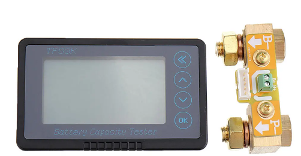
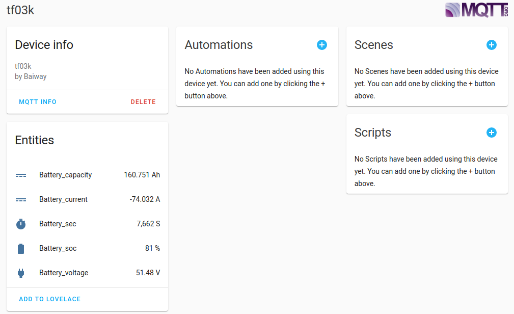

# TF03K serial to MQTT

This projet aim's to export TF03K coulomb meter information
to MQTT and home assistant



## Getting Started

### Have a tk03k coulomb meter

You can find one on aliexpress : https://fr.aliexpress.com/item/32883704077.html

Have a usb to serial ttl : https://fr.aliexpress.com/item/32964764260.html

# Wiring

See 

### Prerequisites

This software was written with docker in mind, the software itself
is written in go and should run on any platform where go is running

You can find instruction to install and configure docker here:
```
https://docs.docker.com/engine/install/debian
```

### Configuration

To configure you docker image you have to setup the following entries
in the supplied config.yaml

```
name: tf03k
manufacturer: Baiway
model: tf03k
mqtt_server: tcp://192.168.5.180:1883
serial_port: /dev/ttyUSB0
```

### Installing

```
make clean docker run
```

### HA Intégration



## Tested platforms

* docker 19.03.8
* Raspberry PI 2+
* Raspberry PI 4
* Rockpi 4
* Synology X86 based

## MQTT message

This is an example of the json message sent to MQTT:
```
{"soc":10,"decivolt":5101,"capamah":20118,"currentma":-1397,"remainsec":52030}
```

## Debugging

... to be written

## TODO

* handle MQTT user / password
* enhance documentation
* add lovelace card template

## Authors

* **Eric Dillmann** - *Initial work* - [edillmann](https://github.com/edillmann)

## License

This project is licensed under the Apache 2 License - see the [apache-license-2.0.md](apache-license-2.0.md) file for details

## Acknowledgments


